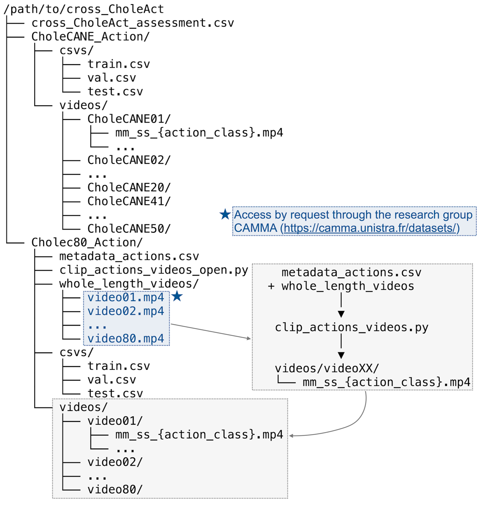

# cross-CholeAct

PyTorch code and dataset utilities for VideoMAE-based surgical action recognition and technical validation in the cross-CholeAct study.

This repository builds on [mcg-nju/VideoMAE](https://github.com/mcg-nju/videomae). The original VideoMAE code has been reduced to the components needed for cross-CholeAct clip classification: model fine-tuning, evaluation, optional feature extraction for domain-gap analysis, and Cholec80-Action clip regeneration from authorized source videos.

## Repository Structure

```text
.
|-- run_class_finetuning.py       # VideoMAE fine-tuning and evaluation entry point
|-- run_class_finetuning.sh       # Convenience launcher for training and evaluation
|-- clip_actions_videos_open.py   # Regenerate Cholec80-Action 3-second clips
|-- domain_gap_analysis.py        # UMAP, MMD, and centroid-distance analysis
|-- data_structure.png            # Dataset folder-tree and clipping workflow figure
|-- datasets.py                   # cross-CholeAct CSV split builder
|-- kinetics.py                   # Decord-based trimmed-video clip loader
|-- engine_for_finetuning.py      # Training/evaluation loops and metric merge
|-- modeling_finetune.py          # VideoMAE classification models
|-- optim_factory.py              # Optimizer and layer-decay utilities
|-- video_transforms.py           # Video transforms
|-- volume_transforms.py          # Clip tensor transforms
|-- functional.py                 # Helper functions used by video_transforms.py
|-- rand_augment.py               # RandAugment utilities
|-- random_erasing.py             # Random erasing augmentation
|-- mixup.py                      # Mixup/CutMix
|-- utils.py                      # Logging, checkpointing, metrics, distributed helpers
|-- LICENSE                       # Repository license
`-- NOTICE.md                     # Third-party notices and attribution
```

## Requirements

The code was developed for CUDA-enabled PyTorch training. A typical environment includes:

```bash
conda create -n cross-choleact python=3.10 -y
conda activate cross-choleact

pip install torch torchvision torchaudio
pip install timm==0.4.12 decord tensorboardX
pip install numpy scipy scikit-learn matplotlib umap-learn pandas tqdm opencv-python
```

Please install the PyTorch build that matches your CUDA version. See the [official PyTorch installation guide](https://pytorch.org/get-started/locally/).

## Downloads

The dataset link is currently private for review and will be switched to public after acceptance.

- cross-CholeAct dataset: [Figshare private link](https://figshare.com/s/d1e0ac5823b74d6d9a59)
- VideoMAE FFT Cholec80-Action model weight: [Google Drive](https://drive.google.com/file/d/1rERw8uLzqEUrCoTL9gtXtgxxDnFOZXTU/view?usp=sharing)
- VideoMAE FFT on Cholec80-Action, then FFT on CholeCANE-Action: [Google Drive](https://drive.google.com/file/d/1xK31GYjIqh8eWBmNLvBWegMCGX7okHB4/view?usp=sharing)

cross-CholeAct is an annotated international video dataset of the Calot's triangle dissection phase assembled from two sources: Cholec80-Action, re-annotated from the publicly available Cholec80 dataset recorded at the University Hospital of Strasbourg, and CholeCANE-Action, newly collected from the National Taiwan University Healthcare System. Together, these sources comprise 110 procedures labeled second-by-second under a shared action taxonomy and organized into context-aware three-second clips that preserve each procedure's chronology, totaling approximately 134,500 labeled action-seconds. The dataset supports temporal action analysis, competency assessment, and evaluation of cross-institutional model transferability beyond action recognition alone.

## Dataset Layout



The figure summarizes the dataset folder-tree schematic and clipping workflow. CholeCANE-Action contains pre-segmented 3-second action clips organized by case-level folders, with corresponding train, validation, and test split files. Cholec80-Action includes metadata, full-length videos, and a clipping script used to generate timestamped action clips with corresponding split files.

Note: Although Cholec80 is publicly available, the original videos are not redistributed in cross-CholeAct and must be requested directly from the [CAMMA research group](https://camma.unistra.fr/datasets/).

The released dataset is organized conceptually as:

```text
cross-CholeAct/
|-- cross_CholeAct_assessment.csv
|-- CholeCANE_Action
|   |-- videos
|   |   |-- CholeCANE01
|   |   |   |-- 00_22_Dissecting.mp4
|   |   |   `-- ...
|   |   `-- ...
|   `-- csvs
|       |-- train.csv
|       |-- val.csv
|       `-- test.csv
`-- Cholec80_Action
    |-- metadata_actions.csv
    |-- whole_length_videos
    |   |-- video01.mp4      # not redistributed; request from CAMMA
    |   `-- ...
    |-- clip_actions_videos_open.py
    |-- videos
    |   |-- video01
    |   |   |-- 00_22_Dissecting.mp4
    |   |   `-- ...
    |   `-- ...
    `-- csvs
        |-- train.csv
        |-- val.csv
        `-- test.csv
```

The VideoMAE loader expects the split folder passed to `--data_path` to contain:

```text
/path/to/csvs
|-- train.csv
|-- val.csv
`-- test.csv
```

Each CSV row is space-delimited:

```text
/absolute/or/relative/path/to/clip.mp4 label
```

Labels are integer action-class indices. The default public workflow uses 8 classes, 16 frames, sampling rate 4, and a ViT-B VideoMAE classifier.

## Cholec80-Action Clip Regeneration

The original Cholec80 source recordings are not redistributed in this repository because they are subject to restricted redistribution terms. After obtaining the original Cholec80 videos from the [CAMMA research group](https://camma.unistra.fr/datasets/), place them as:

```text
Cholec80_Action/
|-- clip_actions_videos_open.py
|-- metadata_actions.csv
|-- whole_length_videos
|   |-- video01.mp4
|   |-- video02.mp4
|   `-- ...
`-- videos
    `-- ...
```

Run:

```bash
python clip_actions_videos_open.py --num_workers 40
```

`clip_actions_videos_open.py` uses fixed input/output paths relative to the working directory:

- `./whole_length_videos`: source Cholec80 full-length videos.
- `./metadata_actions.csv`: action annotations with `video`, `action`, `action_initial_minute`, `action_initial_second`, `action_final_minute`, and `action_final_second` from ([Figshare private link](https://figshare.com/s/d1e0ac5823b74d6d9a59)).
- `./videos/videoXX/`: generated 3-second clips.
- `--num_workers`: number of parallel ffmpeg workers. Use `1` for serial clipping if system load or I/O is limited.

The script checks that `ffmpeg` is available, reads each annotated video, maps second-level labels to action classes, and cuts clips centered on each labeled second. Output clips are named by timestamp and action, for example:

```text
videos/video03/00_22_Dissecting.mp4
videos/video03/00_23_Dissecting.mp4
```

## Fine-Tuning

Set `DATA_DIR` and `MODEL_PATH`, then run:

```bash
DATA_DIR=/path/to/csvs \
MODEL_PATH=/path/to/videomae_checkpoint.pth \
bash run_class_finetuning.sh
```

or run the fine-tuning command directly:

```bash
python run_class_finetuning.py \
    --data_path ${DATA_DIR} \
    --finetune ${MODEL_PATH} \
    --output_dir ./output_finetune_8cls \
    --nb_classes 8 \
    --batch_size 4 \
    --num_workers 32 \
    --epochs 30 \
    --device cuda:0 \
    --save_ckpt_freq 10 \
    --log_dir ./logs_finetune
```

Fine-tuning arguments:

- `--data_path`: folder containing `train.csv`, `val.csv`, and `test.csv`.
- `--finetune`: checkpoint used to initialize VideoMAE.
- `--output_dir`: folder for checkpoints, merged predictions, metric logs, and console logs.
- `--nb_classes`: number of action classes.
- `--batch_size`: training mini-batch size.
- `--num_workers`: DataLoader worker count.
- `--epochs`: number of fine-tuning epochs.
- `--device`: PyTorch device, for example `cuda:0`.
- `--save_ckpt_freq`: save a checkpoint every N epochs.
- `--log_dir`: TensorBoard event output folder.

Only the arguments shown above are intended to be configured for the public workflow. Other VideoMAE training settings are fixed inside `run_class_finetuning.py` to match the technical validation experiments.

Fine-tuning outputs:

```text
output_finetune_8cls/
|-- checkpoint-best.pth       # best validation macro-F1 checkpoint
|-- checkpoint-10.pth         # periodic checkpoint, controlled by --save_ckpt_freq
|-- log.txt                   # JSON-lines train/validation metrics
|-- train_console.log         # mirrored stdout/stderr from training
|-- 0.txt                     # per-rank raw test logits after final testing
`-- result.txt                # merged video-level prediction label and true label

logs_finetune/
`-- events.out.tfevents.*     # TensorBoard summaries
```

`log.txt` records train loss, learning rate, validation accuracy, macro F1, per-class F1, best validation macro F1, epoch, and parameter count. `result.txt` stores one merged prediction row per evaluated clip/video identifier.

## Evaluation

```bash
python run_class_finetuning.py \
    --data_path ${DATA_DIR} \
    --finetune ${MODEL_PATH} \
    --output_dir ./testing_result \
    --nb_classes 8 \
    --batch_size 64 \
    --num_workers 40 \
    --device cuda:0 \
    --eval
```

Evaluation arguments:

- `--data_path`: folder containing the evaluation split files.
- `--finetune`: checkpoint to evaluate.
- `--output_dir`: folder for raw logits, merged predictions, metrics, and console logs.
- `--nb_classes`: number of action classes.
- `--batch_size`: evaluation batch size.
- `--num_workers`: DataLoader worker count.
- `--device`: PyTorch device.
- `--eval`: switch from fine-tuning to evaluation-only mode.

Evaluation outputs:

```text
testing_result/
|-- 0.txt                 # raw per-view logits, label, temporal index, crop index
|-- result.txt            # merged video-level predictions and labels
|-- log.txt               # final top-1, top-5, macro-F1, and per-class F1
|-- eval_console.log      # mirrored stdout/stderr from evaluation
`-- feature_dumps/        # optional, only when --extract_eval_features is used
```

The script reports top-1 accuracy, top-5 accuracy, macro F1, and per-class F1. `0.txt` is used internally by `merge()` and `merge_plus()` to aggregate temporal/spatial view predictions from VideoMAE into clip-level results.

## Feature Dumps for Domain-Gap Analysis

Feature dumping is an optional evaluation-time output for `domain_gap_analysis.py`; it is not required for ordinary model evaluation.

```bash
python run_class_finetuning.py \
    --data_path ${DATA_DIR} \
    --finetune ${MODEL_PATH} \
    --output_dir ./testing_result \
    --nb_classes 8 \
    --batch_size 64 \
    --num_workers 40 \
    --device cuda:0 \
    --eval \
    --extract_eval_features \
    --feature_dump_level video \
    --feature_dump_dir ./testing_result/feature_dumps \
    --feature_dataset_source private \
    --feature_split_name test \
    --feature_save_logits
```

Feature-dump arguments:

- `--extract_eval_features`: enables penultimate VideoMAE feature extraction during evaluation.
- `--feature_dump_level`: feature granularity. The default is `video`; it averages temporal/spatial views into one feature per video/clip identifier. `view` stores one feature per temporal/spatial test view.
- `--feature_dump_dir`: output folder for compressed `.npz` feature files. Defaults to `<output_dir>/feature_dumps` if omitted.
- `--feature_dataset_source`: dataset tag saved in the `.npz`, for example `private` or `public`.
- `--feature_split_name`: split tag saved in the `.npz`, for example `test`.
- `--feature_save_logits`: also stores averaged logits in the `.npz`.

Feature dumps are named as:

```text
<feature_split_name>_<feature_dataset_source>_<feature_dump_level>_features.npz
```

For example:

```text
testing_result/feature_dumps/
|-- test_private_video_features.npz
`-- test_public_video_features.npz
```

Each `.npz` contains:

- `features`: VideoMAE penultimate features.
- `labels`: integer ground-truth labels.
- `predictions` and `preds`: predicted labels.
- `video_ids` and `video_id`: clip/video identifiers.
- `clip_center`: `merged_views` for video-level dumps, or view position for view-level dumps.
- `clip_uid`: unique clip/view identifier.
- `dataset_source`: dataset tag from `--feature_dataset_source`.
- `split_name`: split tag from `--feature_split_name`.
- `feature_dump_level`: `video` or `view`.
- `num_classes`: number of action classes.
- `logits`: present only when `--feature_save_logits` is used.

## Domain-Gap Analysis

Run the domain-gap analysis with one feature dump for CholeCANE-Action and one for regenerated Cholec80-Action:

```bash
python domain_gap_analysis.py \
    --private_features ./testing_result/feature_dumps/test_private_video_features.npz \
    --public_features ./testing_result/feature_dumps/test_public_video_features.npz \
    --output_dir ./domain_gap_outputs
```

Domain-gap arguments:

- `--private_features`: feature `.npz` for CholeCANE-Action or the private/institutional split.
- `--public_features`: feature `.npz` for regenerated Cholec80-Action.
- `--output_dir`: folder for UMAP figures.
- `--private_name`: display label for the private dataset. Default: `CholeCANE_Action`.
- `--public_name`: display label for the public dataset. Default: `Cholec80_Action`.
- `--n_neighbors`: UMAP neighborhood size.
- `--min_dist`: UMAP minimum distance.
- `--seed`: random seed for PCA/UMAP/MMD subsampling.

Outputs:

```text
domain_gap_outputs/
|-- umap_dataset_comparison.tiff
|-- umap_perclass_domgap_legend.tiff
`-- umap_perclass_domgap_nolabel.tiff
```

The terminal output reports global RBF-kernel MMD, dataset centroid distance, per-class MMD, and per-class centroid distance. The figures show the combined UMAP projection and per-class domain-gap summaries.

## Availability

- Dataset repository and DOI/accession: [Figshare private link](https://figshare.com/s/d1e0ac5823b74d6d9a59), to be made public after acceptance.
- Code repository URL and release/version: TODO
- Code license: see `LICENSE`

The original Cholec80 recordings are not included. They must be requested from the CAMMA research group before running the provided clip-regeneration script.

## Citation

If you use this code or dataset, please cite our paper:

```bibtex
@article{cross_choleact,
  title   = {TODO: Paper title},
  author  = {TODO: Author list},
  journal = {TODO},
  year    = {TODO}
}
```

Please also cite the original VideoMAE work and the Cholec80 dataset/source-video work when appropriate.
